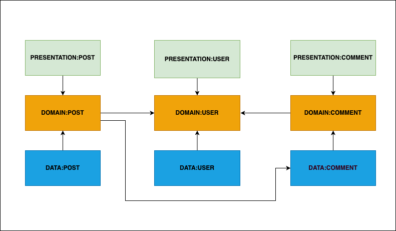

# Android Core

In order to make Android development faster and more consistent across projects, we have developed the **Android Core** project. It is a set of core libraries that contains all base classes, interfaces, and util methods for developing applications based on our standards, community best practices and Clean Architecture guidelines.

It contains **Domain**, **Data** and **Presentation** independent libraries, and also **Test** library for easier and quicker writing of unit tests. All of these libraries can be included as dependency independently, or all together, which depends on the project organization (single or multi module).

## Download

We have [bill of materials (BOM)][bom] available to help you keep Android Core artifacts up to date, and be sure about version compatibility.

```kotlin
    dependencies {
       // define BOM and its version
       implementation(platform("com.htecgroup.core:bom:1.0.0"))

       // define any required Android Core artifacts without version
       implementation("com.htecgroup.core:domain")
       implementation("com.htecgroup.core:data")
       implementation("com.htecgroup.core:presentation")

       // define a BOM and its version for test
       testImplementation("com.htecgroup.core:test")

    }
```

## Requirements

Android Core requires at minimum Android 5.0+ (API level 21+) and Java 11.

### Dependencies

Tech stack:
- Kotlin
- Coroutines
- Flow
- ViewModel
- Databinding/Compose
- Navigation
- Hilt
- Retrofit
- Moshi

Test stack:
- JUnit5
- Mockk
- Arch Core
- Coroutines Test
- Kluent

## Support different project architectures

Android apps architecture has gone through several phases since its inception, and has evolved over time. Developers used a variety of approaches, including Model-View-Controller (MVC), Model-View-Presenter (MVP), Model-View-ViewModel (MVVM) and others. Lately, driven by the need for more modular, maintainable, scalable, with clear separation of concerns, Clean Architecture has become a popular approach. Choosing the right architecture pattern depends on the specific requirements and goals of the application, as well as the development team’s expertise and preferences.

There is one more thing that always comes up when debating Android architecture - [Modularization][modularization_pattern]. It is a process of dividing a large monolithic application into smaller, self-contained modules that can be developed, tested, and deployed independently.

We decided to embrace the combination of Clean Architecture (data, domain and presentation layers) and modularization - which gives us a variety of different architecture possibilities. While there is no one-size-fits-all solution, we try to maintain our Core lib as flexible as possible to support the big variety of approaches. Some of them are explained below.

### Single-module projects

A single-module Android app architecture is an approach where all the code for an Android app is organized into single module. It is much simpler to set up and maintain, and easier to navigate.

But it comes with some cons:
- Difficult to scale as the app grows and becomes more complex,
- Higher risk of coupling between different components,
- Limited flexibility for bigger teams, as developers cannot separate the app into different components that can be developed and tested independently.

If the app project is organized as a single-module app, all needed Core artifacts can be added as BOM or individual dependencies.

### Multi-module projects

Multi-module Android app architecture is an approach where an app is divided into several modules, each with a specific responsibility and clear dependencies.

Pros:
- App can be scaled more effectively because developers can work on specific features and functionality independently. Each module can be developed, tested, and deployed separately, making it easier to manage and scale the app. This also enhances team collaboration and allows faster development.
- Makes code more manageable and easier to maintain. Developers can focus on specific modules, which makes it easier to modify and test the code without affecting other parts of the app.
- Significantly reduce build times, as developers only need to rebuild the modules that have changed.

Cons:
- More complex than single module architecture, especially for smaller apps. It requires careful planning and design to ensure that the modules are correctly defined and that there is no unwanted coupling between the modules.
- Developers may need to spend more time learning how to work with multi-module architecture, especially if they are new to the approach. This can increase the time and effort required for development.
- Maintaining multiple modules can be more expensive than maintaining a single module, especially if the modules are poorly designed. Developers need to ensure that the modules are well-defined and that there is no unwanted coupling between them.

#### Modularization by layers

This is the best match for our Android Core library. If the Android project is splited into layers as modules (domain, data, presentation), these modules can independently import any of our core lib artifacts. It is recommended to split presentation from infrastructure and app layer where dependency injection should be defined. This way, dependency management could be better implemented and handled.


#### Modularization by features

If the modularization is implemented by features, every module should import all of the Core artifacts. This approach is supported, but not recommended as in this way we could not make build time faster from the perspective of core modules.


#### Modularization by both features and layers

For bigger Android projects, modularization can be done both vertically and horizontally - by layers and by features. Every module can import only one of the core artifacts (domain, data, presentation). This way, build time will be faster and there is a possibility to organize team members to work on features independently.



### Presentation - Databinding & Compose

Data Binding and Jetpack Compose are two UI frameworks in Android that can be used to create efficient and responsive user interfaces. While Data Binding allows developers to connect data models to UI elements, Jetpack Compose provides a declarative programming model that simplifies the creation of complex UIs.

Android Core lib supports both, and can be included into a project as follows:
```kotlin
    dependencies {
       // Compose
       implementation("com.htecgroup.core:presentation")
       
       // Databinding
       implementation("com.htecgroup.core:presentation-databinding")
    }
```
Both approaches will be maintained until Databinding is completely deprecated in favour of Compose.

## License

Android Core Lib is released under the [Apache 2.0 license][license].

```
Copyright 2023 HTEC Group Inc.

Licensed under the Apache License, Version 2.0 (the "License");
you may not use this file except in compliance with the License.
You may obtain a copy of the License at

   http://www.apache.org/licenses/LICENSE-2.0

Unless required by applicable law or agreed to in writing, software
distributed under the License is distributed on an "AS IS" BASIS,
WITHOUT WARRANTIES OR CONDITIONS OF ANY KIND, either express or implied.
See the License for the specific language governing permissions and
limitations under the License.
```

## Disclaimer

This is not an officially supported HTEC Group product.

[bom]: https://docs.gradle.org/6.2/userguide/platforms.html#sub:bom_import
[modularization_pattern]: https://developer.android.com/topic/modularization/patterns
[dependeny_diagram]: https://medium.com/swift2go/clean-architecture-for-massivetobe-mobile-apps-bf8e44a98b37
[license]: https://github.com/htecgroup/android-core/blob/main/LICENSE
